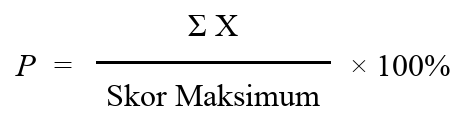
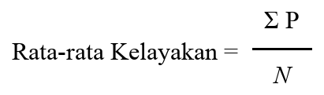

# BAB IV: IMPLEMENTASI DAN PENGUJIAN SISTEM

### 4.1 Implementasi Perangkat Keras dan Perangkat Lunak
Tahap implementasi merupakan tahap di mana sistem siap untuk dioperasikan pada keadaan yang sebenarnya. Pada tahap ini, spesifikasi kebutuhan sistem yang telah dirancang sebelumnya akan diwujudkan ke dalam bentuk aplikasi berbasis web yang siap dideploy. Keberhasilan implementasi sistem sangat bergantung pada kesiapan perangkat keras (*hardware*) dan perangkat lunak (*software*) yang digunakan, baik pada sisi server sebagai penyedia layanan maupun pada sisi klien (*user*) sebagai pengguna akhir layanan perpustakaan digital.

#### 4.1.1 Spesifikasi Perangkat Lunak (Software)
Pengembangan sistem **SiPus Digital** (Sistem Informasi Perpustakaan Digital) dilakukan dengan menggunakan arsitektur modern berbasis PHP dan teknologi cloud. Spesifikasi perangkat lunak yang diimplementasikan dalam pembangunan sistem ini dijabarkan sebagai berikut:

1. **Sistem Operasi**: macOS / Windows 10/11 (digunakan sebagai lingkungan pengembangan lokal) dan Linux Debian/Ubuntu (digunakan dalam lingkungan container produksi di cloud Render).
2. **Bahasa Pemrograman Utama**:
   * **PHP v8.5 (Lokal) / v8.3 (Produksi)**: Digunakan sebagai bahasa pemrograman utama di sisi server (*backend*) untuk menangani logika bisnis perpustakaan, manipulasi database, dan routing sistem.
   * **JavaScript (ES6+)**: Digunakan untuk meningkatkan interaktivitas pada antarmuka pengguna (*frontend*), seperti validasi formulir sisi klien, pengelolaan interaksi keranjang belanja buku, dan manajemen grafik.
3. **Framework Backend (Laravel v12.13.0)**:
   * Menggunakan arsitektur *Model-View-Controller* (MVC) untuk memisahkan logika pemrosesan data (Model), representasi antarmuka (View), dan kontrol logika alur aplikasi (Controller).
   * Memanfaatkan fitur *Eloquent ORM* untuk melakukan query database secara aman dan efisien guna menghindari ancaman *SQL Injection*.
   * Menggunakan *Blade Template Engine* untuk penyusunan halaman visual secara modular dan reusable.
4. **CSS Framework (Tailwind CSS v4.1.6)**: Digunakan untuk merancang antarmuka pengguna yang responsif (*responsive web design*). Tailwind CSS mempermudah penataan letak (*layouting*) menggunakan sistem grid dan flexbox, sehingga tampilan website tetap optimal saat diakses melalui perangkat desktop, tablet, maupun smartphone.
5. **Database Management System (DBMS)**:
   * **SQLite (Lokal)**: Digunakan untuk mempercepat proses pengembangan awal di komputer lokal tanpa memerlukan konfigurasi server database yang kompleks.
   * **PostgreSQL (Supabase)**: Digunakan pada lingkungan produksi (*live production*). Database ini ditempatkan di server cloud Supabase yang terhubung menggunakan teknologi *Connection Pooling* (port 6543) berbasis Supavisor untuk mengoptimalkan alokasi koneksi database dari server aplikasi.
6. **Library Ekspor Dokumen (Barryvdh Laravel DomPDF)**: Digunakan untuk mengubah representasi data HTML/CSS menjadi dokumen PDF secara otomatis. Fitur ini diimplementasikan pada pencetakan tiket antrean peminjaman buku untuk diunduh oleh mahasiswa.
7. **Web Server & Containerization (Docker)**: Menggunakan Dockerfile *multi-stage build* untuk membungkus aplikasi. Tahap pertama (*node-builder*) mengompilasi aset JS dan CSS menggunakan Node.js, dan tahap kedua menyalin berkas aplikasi ke dalam server Apache dengan ekstensi PHP PostgreSQL (`pdo_pgsql`) yang siap dijalankan.
8. **Platform Hosting (Render PaaS)**: Digunakan untuk mendeploy aplikasi secara otomatis dari repositori GitHub secara terus-menerus (*Continuous Deployment*).

#### 4.1.2 Spesifikasi Perangkat Keras (Hardware)
Kebutuhan perangkat keras minimal dan rekomendasi yang diperlukan untuk menjalankan sistem ini terbagi menjadi dua bagian, yaitu:

1. **Sisi Pengguna (Client)**:
   * **Processor**: Intel Core i3 atau AMD Ryzen 3 (Frekuensi minimal 1.6 GHz).
   * **RAM**: Minimal 4 GB (agar lancar menjalankan sistem operasi dan web browser modern secara bersamaan).
   * **Media Penyimpanan**: Sisa ruang harddisk/SSD minimal 1 GB.
   * **Perangkat Input**: Keyboard, Mouse/Touchpad, dan Monitor dengan resolusi minimal 1366x768 piksel.

2. **Sisi Server (Hosting Platform)**:
   * **CPU**: Minimal 0.1 Shared CPU Core (Menggunakan spesifikasi *Hobby/Free Instance* di Render).
   * **RAM**: Minimal 512 MB.
   * **Storage**: SSD dengan kapasitas penyimpanan dinamis.

---

### 4.2 Implementasi Basis Data (Database)
Basis data diimplementasikan pada PostgreSQL (Supabase) dengan relasi antar tabel yang terintegrasi untuk mendukung seluruh aktivitas transaksi perpustakaan digital. Struktur fisik dari masing-masing tabel yang digunakan dijabarkan secara rinci sebagai berikut:

#### 1. Tabel `users`
Tabel ini berfungsi untuk menyimpan seluruh informasi data pengguna sistem, baik admin perpustakaan maupun mahasiswa (anggota).
* Atribut Utama:
  * `id` (BigInteger, Primary Key, Auto Increment): ID unik untuk setiap pengguna.
  * `name` (Varchar, 255): Nama lengkap pengguna.
  * `username` (Varchar, 255, Unique): Username untuk autentikasi login.
  * `email` (Varchar, 255, Unique): Alamat email pengguna.
  * `password` (Varchar, 255): Kata sandi pengguna yang telah dienkripsi menggunakan algoritma *Bcrypt*.
  * `role` (Enum: `admin`, `user`): Menentukan tingkat hak akses dalam sistem.
  * `identifier` (Varchar, 50, Nullable): NIM untuk mahasiswa atau NIDN/NIP untuk staf perpustakaan.
  * `phone` (Varchar, 20, Nullable): Nomor telepon pengguna untuk keperluan kontak.
  * `avatar` (Varchar, 255, Nullable): Path penyimpanan foto profil pengguna.
  * `created_at` & `updated_at` (Timestamp): Informasi waktu pembuatan dan pembaruan data.

#### 2. Tabel `categories`
Tabel ini digunakan untuk mengklasifikasikan koleksi buku ke dalam kategori tertentu guna mempermudah proses pencarian oleh mahasiswa.
* Atribut Utama:
  * `id` (BigInteger, Primary Key, Auto Increment): ID unik kategori.
  * `name` (Varchar, 255): Nama kategori (misal: "Sains", "Fiksi", "Teknologi").
  * `slug` (Varchar, 255, Unique): Representasi URL ramah pengguna untuk pencarian kategori.

#### 3. Tabel `books`
Tabel ini berfungsi untuk menyimpan seluruh katalog koleksi buku yang tersedia di perpustakaan digital.
* Atribut Utama:
  * `id` (BigInteger, Primary Key, Auto Increment): ID unik buku.
  * `title` (Varchar, 255): Judul buku.
  * `author` (Varchar, 255): Penulis atau pengarang buku.
  * `description` (Text): Sinopsis atau deskripsi singkat mengenai isi buku.
  * `stock` (Integer): Jumlah fisik buku yang tersedia di perpustakaan.
  * `cover` (Varchar, 255, Nullable): Path lokasi file gambar cover buku di direktori penyimpanan.
  * `category_id` (BigInteger, Foreign Key): Menghubungkan buku ke tabel `categories` (on delete cascade).

#### 4. Tabel `queues`
Tabel ini digunakan untuk mencatat antrean pengajuan pemesanan (booking) buku yang diajukan oleh mahasiswa sebelum disetujui oleh admin.
* Atribut Utama:
  * `id` (BigInteger, Primary Key, Auto Increment): ID unik antrean.
  * `user_id` (BigInteger, Foreign Key): Terhubung ke tabel `users`.
  * `book_id` (BigInteger, Foreign Key): Terhubung ke tabel `books`.
  * `status` (Enum: `menunggu`, `disetujui`): Status pengajuan antrean dari mahasiswa.

#### 5. Tabel `loans`
Tabel utama transaksi yang mencatat seluruh aktivitas peminjaman dan pengembalian buku di perpustakaan.
* Atribut Utama:
  * `id` (BigInteger, Primary Key, Auto Increment): ID unik peminjaman.
  * `user_id` (BigInteger, Foreign Key): Terhubung ke tabel `users`.
  * `book_id` (BigInteger, Foreign Key): Terhubung ke tabel `books`.
  * `borrowed_at` (Date, Nullable): Tanggal buku mulai diambil/dipinjam.
  * `returned_at` (Date, Nullable): Tanggal buku dikembalikan oleh peminjam.
  * `status` (Enum: `menunggu`, `dipinjam`, `dikembalikan`, `ditolak`): Status transaksi terkini.
  * `fine` (Integer, Default: 0): Jumlah denda jika mahasiswa terlambat mengembalikan buku.

#### 6. Tabel `notifications`
Tabel ini berfungsi untuk menyimpan pesan pemberitahuan yang dikirimkan oleh sistem kepada pengguna.
* Atribut Utama:
  * `id` (BigInteger, Primary Key, Auto Increment): ID unik notifikasi.
  * `user_id` (BigInteger, Foreign Key): Terhubung ke tabel `users`.
  * `message` (Text): Isi pesan notifikasi (misal: "Pengajuan booking buku A telah disetujui").
  * `read_at` (Timestamp, Nullable): Mencatat waktu notifikasi dibaca oleh pengguna.

#### 7. Tabel `cart_items`
Tabel penampung sementara (*temporary*) untuk menampung daftar buku pilihan mahasiswa sebelum mereka menekan tombol konfirmasi booking peminjaman.
* Atribut Utama:
  * `id` (BigInteger, Primary Key, Auto Increment): ID unik keranjang.
  * `user_id` (BigInteger, Foreign Key): Terhubung ke tabel `users`.
  * `book_id` (BigInteger, Foreign Key): Terhubung ke tabel `books`.

---

### 4.3 Implementasi Antarmuka (User Interface)
Implementasi antarmuka pengguna dirancang berdasarkan kebutuhan sistem dengan menerapkan prinsip-prinsip *User Experience* (UX) yang bersih, minimalis, dan mudah dipahami. Berikut adalah rincian fungsionalitas dari setiap antarmuka yang diimplementasikan:

#### 4.3.1 Halaman Login
Halaman login merupakan gerbang utama bagi setiap pengguna untuk masuk ke dalam sistem perpustakaan digital **SiPus Digital**. Tampilan halaman login dirancang bersih dan minimalis menggunakan tata letak terpusat (*centered layout*) dengan ilustrasi visual perpustakaan di sampingnya untuk meningkatkan daya tarik estetika. Halaman ini memuat dua kolom input utama, yaitu Username atau Alamat Email dan Password. Di sisi pemrograman, ketika tombol "Login" ditekan, *request* dikirimkan ke `AuthController@login` untuk memvalidasi kredensial pengguna terhadap tabel `users` di database. Jika data yang diinput valid, sistem akan mendeteksi peran (*role*) dari akun tersebut. Jika akun bernilai `admin`, sistem mengarahkan ke dashboard admin. Sebaliknya, jika akun bernilai `user`, sistem akan mengarahkannya ke dashboard mahasiswa/user. Jika data tidak cocok, form login akan merender kembali halaman serta memunculkan peringatan kesalahan (*error message*) berbasis sesi.

#### 4.3.2 Dashboard Admin
Halaman Dashboard Admin dirancang sebagai panel pusat kendali visual bagi staf perpustakaan (Admin). Tampilan halaman ini mengadopsi struktur *sidebar navigation* untuk memudahkan perpindahan menu manajemen. Halaman dashboard admin memuat ringkasan data statistik perpustakaan dalam bentuk kartu ringkasan (*summary cards*) yang interaktif. Kartu statistik ini memuat total data anggota perpustakaan yang terdaftar, total judul koleksi buku yang tersedia, jumlah transaksi peminjaman aktif, dan jumlah antrean reservasi buku baru yang masih menunggu verifikasi. Selain itu, dashboard admin dilengkapi dengan komponen visualisasi data berupa grafik garis (*line chart*) dan grafik batang (*bar chart*) interaktif. Grafik ini berfungsi untuk memetakan statistik transaksi peminjaman buku per minggu dan per bulan secara real-time. Hal ini memudahkan admin dalam memantau keaktifan anggota perpustakaan serta menganalisis buku-buku apa saja yang paling sering dipinjam oleh mahasiswa.

#### 4.3.3 Dashboard Mahasiswa
Dashboard Mahasiswa merupakan portal utama bagi mahasiswa yang telah sukses melakukan autentikasi login ke dalam sistem. Desain antarmuka dashboard ini memprioritaskan penyajian informasi yang bersifat personal bagi mahasiswa tersebut. Halaman ini memuat widget informasi ringkas mengenai aktivitas perpustakaan mahasiswa, seperti jumlah buku yang sedang dipinjam saat ini, jumlah pengajuan antrean buku yang statusnya masih menunggu verifikasi admin, serta riwayat buku yang telah selesai dikembalikan. Selain itu, dashboard ini menampilkan daftar rekomendasi buku-buku terbaru yang ditambahkan oleh perpustakaan secara visual. Apabila mahasiswa sedang dalam proses mengajukan peminjaman buku, dashboard mahasiswa juga akan menampilkan status dan posisi antrean mereka secara real-time untuk memberikan kejelasan informasi.

#### 4.3.4 Data Buku
Halaman Data Buku berfungsi sebagai katalog utama perpustakaan digital, baik yang diakses oleh admin untuk keperluan pengelolaan maupun oleh mahasiswa untuk keperluan pencarian.
* Dari sisi Admin, antarmuka ini menyediakan tabel data seluruh koleksi buku perpustakaan yang dilengkapi fungsi CRUD (Create, Read, Update, Delete). Admin dapat menambahkan buku baru lengkap dengan file gambar cover buku yang akan disimpan ke dalam direktori penyimpanan publik.
* Dari sisi Mahasiswa, halaman ini dirancang dalam bentuk grid card yang menampilkan visual cover buku secara rapi. Mahasiswa dapat melihat judul buku, nama pengarang, kategori buku, dan status ketersediaan stok fisik buku. Halaman ini juga dilengkapi kolom pencarian dinamis yang menyaring daftar buku berdasarkan judul atau pengarang secara real-time, serta filter saringan kategori untuk memudahkan navigasi.

#### 4.3.5 Booking Buku
Antarmuka Booking Buku memfasilitasi proses reservasi atau pemesanan buku secara online oleh mahasiswa sebelum mereka mengambil buku secara fisik di perpustakaan. Proses booking dimulai ketika mahasiswa menelusuri katalog buku dan menekan tombol "Pinjam Sekarang" pada buku yang diinginkan. Buku pilihan mahasiswa tersebut akan ditambahkan ke dalam keranjang pemesanan sementara (*cart items*). Di halaman keranjang, mahasiswa dapat melihat daftar buku yang hendak di-booking. Ketika tombol "Ajukan Peminjaman" ditekan, sistem akan memproses transaksi dan memasukkan data pemesanan ke dalam tabel antrean (`queues`) dengan status awal `menunggu`. Admin kemudian akan melihat pengajuan tersebut di panel manajemen antrian admin untuk disetujui atau ditolak sesuai ketersediaan fisik buku.

#### 4.3.6 Tiket Booking
Antarmuka Tiket Booking menampilkan halaman bukti transaksi resmi setelah pengajuan booking buku mahasiswa disetujui oleh admin perpustakaan. Halaman antrean buku pada sisi mahasiswa akan memunculkan tombol **Cetak Tiket**. Ketika tombol tersebut diklik, Laravel akan memproses data transaksi peminjaman tersebut dan mengeksekusi library `DomPDF` untuk merender tampilan tiket ke dalam format file PDF secara dinamis. Dokumen PDF Tiket Booking ini memuat informasi lengkap meliputi nama mahasiswa, nomor identitas mahasiswa (NIM), nomor telepon, judul buku yang dipinjam, nomor antrean booking unik, serta instruksi batas tanggal pengambilan buku fisik di perpustakaan. Dokumen PDF ini dapat diunduh dan disimpan oleh mahasiswa untuk ditunjukkan kepada petugas perpustakaan sebagai bukti pengambilan buku yang sah.

#### 4.3.7 Pengembalian Buku
Halaman Pengembalian Buku diakses oleh admin perpustakaan untuk mengelola dan mencatat pengembalian buku fisik yang dilakukan oleh mahasiswa. Halaman ini menampilkan tabel seluruh transaksi peminjaman aktif yang berstatus `dipinjam`. Di setiap baris data peminjaman, admin disediakan tombol aksi **Konfirmasi Kembali**. Ketika admin mengklik tombol ini, sebuah formulir konfirmasi pengembalian akan muncul di mana admin dapat mengonfirmasi apakah buku dikembalikan tepat waktu atau terlambat. Setelah admin mengonfirmasi pengembalian, status peminjaman pada database akan diperbarui menjadi `dikembalikan`, mencatat tanggal pengembalian saat ini, dan secara otomatis menambah kembali stok fisik buku tersebut (+1) agar dapat dipinjam oleh mahasiswa lain.

#### 4.3.8 Denda
Antarmuka Denda terintegrasi di dalam halaman riwayat peminjaman mahasiswa dan sistem konfirmasi pengembalian admin. Sistem memiliki aturan denda keterlambatan pengembalian buku sebesar **Rp10.000 per hari per buku**. Ketika admin memproses pengembalian buku di halaman konfirmasi pengembalian, sistem secara otomatis membandingkan tanggal pengembalian hari ini dengan tanggal jatuh tempo kembali yang disepakati. Jika tanggal hari ini melebihi tanggal jatuh tempo, sistem menghitung selisih hari keterlambatan, mengalikan jumlah hari tersebut dengan tarif denda Rp10.000, dan menyimpan total denda ke dalam atribut `fine` di database. Nilai denda ini kemudian ditampilkan di tabel riwayat transaksi mahasiswa dan laporan admin agar mahasiswa mengetahui total biaya denda yang harus dilunasi kepada petugas perpustakaan.

#### 4.3.9 Laporan
Halaman Laporan menyediakan fitur bagi admin perpustakaan untuk mencetak rekapitulasi data laporan statistik perpustakaan digital secara periodik. Pada halaman Dashboard Admin, disediakan tombol **Ekspor PDF** atau **Cetak Laporan**. Ketika diklik, sistem akan mengumpulkan data statistik (seperti jumlah total anggota, total judul buku, total peminjaman disetujui, total peminjaman pending) serta rekapitulasi peminjaman bulanan ke dalam sebuah view khusus, kemudian mengekspornya menjadi berkas laporan PDF bernama `rekap_peminjaman.pdf`. Laporan PDF ini memiliki tata letak formal yang rapi, lengkap dengan kop surat dan kolom tabel rekap data yang siap untuk dicetak dan diserahkan kepada kepala perpustakaan atau pihak manajemen sebagai laporan berkala.

---

### 4.4 Pengujian Sistem (Black Box Testing)

| No. | Fitur | Skenario | Hasil |
|---|---|---|---|
| 1 | Login Sistem | Menginput username dan password yang salah pada form login. | Sistem menolak login dan menampilkan pesan error. |
| 2 | Login Admin | Menginput username dan password Admin yang benar. | Berhasil masuk ke Dashboard Admin perpustakaan. |
| 3 | Login Mahasiswa | Menginput username dan password Mahasiswa yang benar. | Berhasil masuk ke Dashboard Mahasiswa. |
| 4 | Tambah Buku | Menambahkan buku baru dengan melampirkan file non-gambar pada cover. | Sistem menolak simpan dan memunculkan pesan validasi format cover. |
| 5 | Tambah Buku | Menambahkan buku baru dengan melampirkan data dan file cover yang valid. | Berhasil menyimpan data ke database dan mengunggah cover. |
| 6 | Pencarian Buku | Menginput kata kunci judul buku pada kolom pencarian katalog. | Berhasil menampilkan daftar buku yang sesuai secara real-time. |
| 7 | Booking Buku | Mengajukan peminjaman buku yang memiliki jumlah stok habis (0). | Peminjaman ditolak oleh sistem karena stok tidak mencukupi. |
| 8 | Booking Buku | Mengajukan peminjaman buku yang memiliki stok tersedia. | Berhasil mencatat pengajuan booking ke database dengan status menunggu. |
| 9 | Persetujuan Booking | Admin menyetujui pengajuan booking buku mahasiswa. | Status antrean berubah menjadi disetujui dan stok buku berkurang 1. |
| 10 | Cetak Tiket PDF | Mahasiswa mengunduh tiket booking peminjaman yang disetujui. | Berhasil mengunduh dokumen PDF tiket booking antrean secara otomatis. |
| 11 | Pengembalian Buku | Admin mengonfirmasi pengembalian buku peminjaman mahasiswa. | Status peminjaman menjadi dikembalikan dan stok buku bertambah 1. |

---

### 4.5 User Acceptance Testing (UAT)
*User Acceptance Testing* (UAT) merupakan tahap pengujian yang dilakukan oleh pengguna akhir (*end-user*) untuk mengukur sejauh mana sistem yang dibangun dapat diterima dan memenuhi kebutuhan operasional perpustakaan. 

#### 4.5.1 Metodologi Pengujian
Pengujian dilakukan terhadap **10 orang responden** yang terdiri dari 2 orang staf perpustakaan (sebagai representasi Admin) dan 8 orang mahasiswa (sebagai representasi User/Mahasiswa). Pengumpulan data menggunakan kuesioner dengan Skala Likert 5 poin untuk mengukur persepsi pengguna:
* 5: Sangat Setuju (SS)
* 4: Setuju (S)
* 3: Cukup Setuju (CS)
* 2: Tidak Setuju (TS)
* 1: Sangat Tidak Setuju (STS)

Untuk menghitung persentase kelayakan dari hasil kuesioner, digunakan rumus persentase kelayakan berikut:

Di mana:
* $P$ = Persentase Kelayakan (%)
* $\sum X$ = Total Skor Jawaban Responden
* $\text{Skor Maksimum}$ = Jumlah Responden $\times$ Skor Tertinggi Likert ($10 \times 5 = 50$)

Rata-rata persentase kelayakan keseluruhan dihitung menggunakan rumus:

Di mana:
* $\sum P$ = Jumlah Total Persentase Seluruh Indikator
* $N$ = Jumlah Indikator Pertanyaan ($5$ pertanyaan)

#### 4.5.2 Kuesioner Pengujian
Indikator pertanyaan yang diajukan kepada responden meliputi:
1. **P1 (Usability)**: Apakah tampilan antarmuka aplikasi SiPus Digital mudah dipahami dan digunakan?
2. **P2 (Functionality)**: Apakah fitur pencarian buku dan pengajuan booking online berjalan sesuai kebutuhan?
3. **P3 (Performance)**: Apakah sistem memproses transaksi peminjaman dan pengunduhan PDF dengan cepat tanpa kendala?
4. **P4 (Efficiency)**: Apakah aplikasi ini membantu menghemat waktu peminjaman buku dibandingkan sistem manual?
5. **P5 (Reliability)**: Apakah sistem stabil dan bebas dari kendala/error saat digunakan?

#### 4.5.3 Hasil Analisis Data UAT

| No. | Indikator Pertanyaan | Total Skor (Maks. 50) | Persentase Kelayakan | Kategori Kelayakan |
|---|---|---|---|---|
| 1 | P1 (Usability) - Antarmuka mudah dipahami | 44 / 50 | 88% | Sangat Layak |
| 2 | P2 (Functionality) - Fitur berjalan sesuai kebutuhan | 45 / 50 | 90% | Sangat Layak |
| 3 | P3 (Performance) - Kecepatan transaksi & cetak PDF | 43 / 50 | 86% | Sangat Layak |
| 4 | P4 (Efficiency) - Menghemat waktu dibanding sistem manual | 46 / 50 | 92% | Sangat Layak |
| 5 | P5 (Reliability) - Stabilitas sistem bebas kendala | 44 / 50 | 88% | Sangat Layak |
| **-** | **Rata-rata Kelayakan Keseluruhan** | **222 / 250** | **88.8%** | **Sangat Layak** |

---
---

# BAB V: KESIMPULAN DAN SARAN

### 5.1 Kesimpulan
Berdasarkan hasil analisis, perancangan, implementasi, dan pengujian yang dilakukan terhadap aplikasi **SiPus Digital** (Sistem Informasi Perpustakaan Digital), maka dapat ditarik beberapa kesimpulan utama sebagai berikut:

1. **Sistem Berhasil Dirancang dan Diimplementasikan**: Aplikasi perpustakaan digital berhasil dikembangkan secara utuh menggunakan framework Laravel 12, database cloud PostgreSQL (Supabase), dan dideploy secara online di platform Render. Pemanfaatan Dockerfile *multi-stage build* berhasil menjamin konsistensi performa aplikasi antara lingkungan lokal dan server cloud produksi.
2. **Fungsionalitas Booking Online dan Tiket PDF Berjalan Sempurna**: Fitur reservasi atau booking buku secara mandiri oleh mahasiswa secara online berhasil diimplementasikan dengan baik. Sistem mampu secara otomatis mencatat antrean, mengirimkan notifikasi persetujuan admin, memotong stok buku secara akurat, serta memfasilitasi pencetakan tiket antrean dalam format dokumen PDF sebagai bukti transaksi fisik yang sah.
3. **Efisiensi Layanan Perpustakaan Meningkat Secara Signifikan**: Berdasarkan hasil pengujian UAT (92% untuk indikator efisiensi), sistem baru ini terbukti menghemat waktu layanan perpustakaan secara drastis. Mahasiswa tidak perlu lagi datang secara fisik hanya untuk mengecek ketersediaan buku atau mengantre di meja pelayanan perpustakaan, karena proses booking dan pengecekan stok buku dapat diakses secara real-time dari mana saja.

### 5.2 Saran
Meskipun sistem informasi perpustakaan digital ini telah berjalan dengan baik, terdapat beberapa aspek yang dapat dikembangkan lebih lanjut di masa mendatang:

1. **Pengembangan Aplikasi Mobile Native**: Mengembangkan aplikasi pendukung versi mobile (menggunakan Flutter atau React Native) agar mahasiswa dapat mengakses katalog buku perpustakaan secara lebih mudah dan menerima pemberitahuan push langsung di smartphone mereka.
2. **Integrasi Teknologi QR Code**: Menambahkan kode QR (*QR Code*) unik pada dokumen tiket booking PDF. Hal ini akan memudahkan petugas perpustakaan untuk melakukan konfirmasi pengambilan buku cukup dengan memindai (*scanning*) tiket menggunakan kamera smartphone atau alat scanner, guna meminimalkan kesalahan input data manual.
3. **Integrasi WhatsApp Gateway**: Menghubungkan sistem perpustakaan dengan API WhatsApp Gateway (seperti Fonnte atau sejenisnya) untuk mengirimkan notifikasi pengingat otomatis terkait tanggal jatuh tempo pengembalian buku langsung ke nomor WhatsApp pribadi mahasiswa untuk meminimalkan keterlambatan.
4. **Integrasi Sistem Autentikasi Kampus (Single Sign-On)**: Mengintegrasikan sistem login perpustakaan dengan sistem database akademik kampus pusat (Single Sign-On / SSO) agar mahasiswa dapat menggunakan akun portal akademik utama mereka tanpa perlu melakukan registrasi ulang di sistem perpustakaan.
